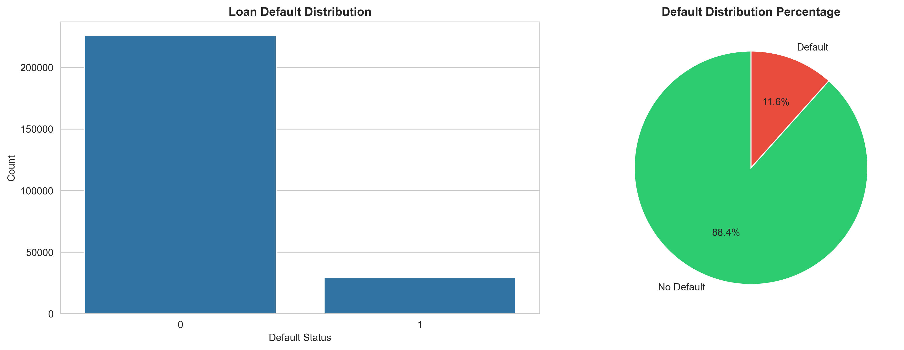
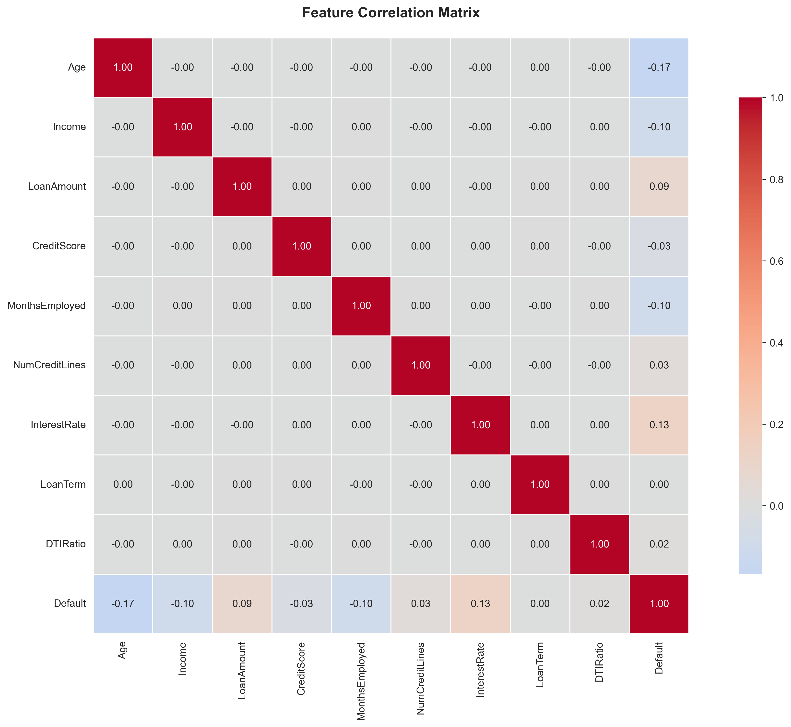
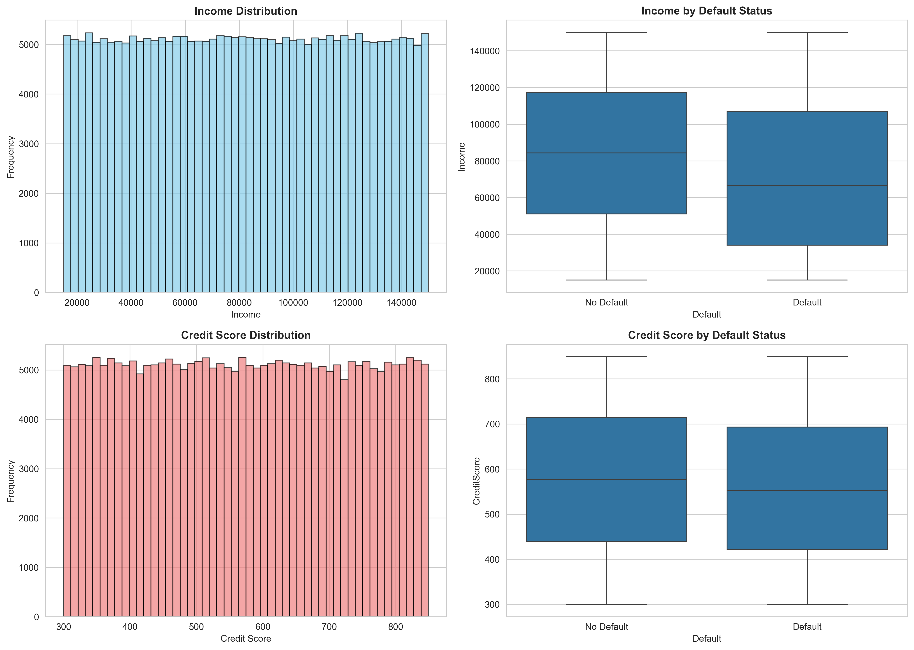
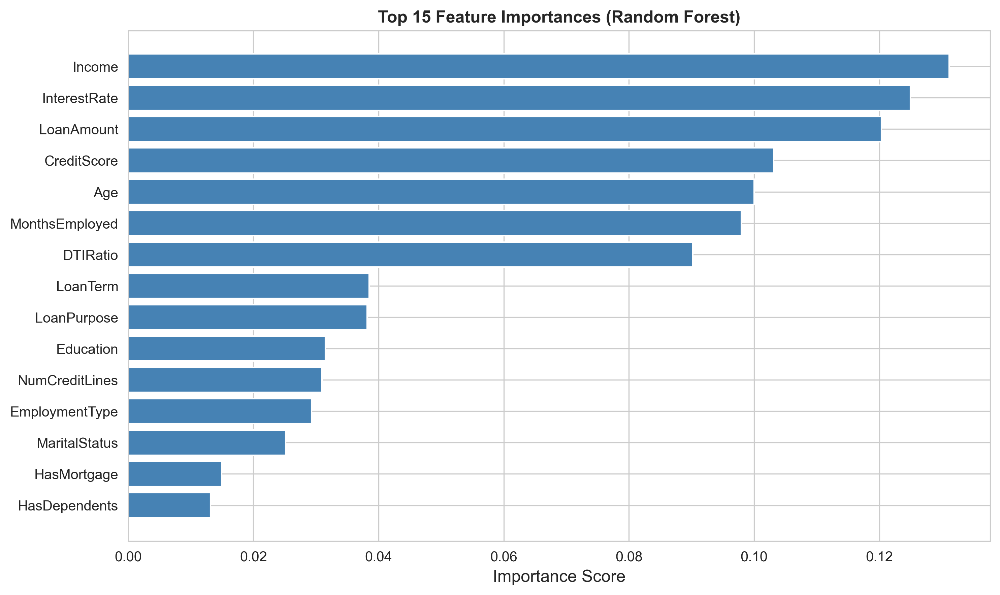

# Loan Default Risk Prediction System

## Executive Summary

The **Loan Default Risk Prediction System** is a machine learning solution designed to systematically identify and assess the probability that borrowers will default on their loans. Built with professional-grade engineering practices, this system enables financial institutions to make data-driven lending decisions, minimize credit risk exposure, and optimize portfolio performance.

---

## Why This Model: The Business Case

### The Problem
Financial institutions face a critical challenge: determining which borrowers are likely to repay loans and which may default. Traditional assessment methods rely on limited factors and subjective judgment, leading to:

- **High Default Rates**: Lenders lose significant capital to unexpected defaults
- **Inconsistent Decision-Making**: Manual underwriting leads to variable approval standards
- **Opportunity Cost**: Overly conservative lending policies reject creditworthy borrowers
- **Portfolio Risk**: Lack of accurate risk quantification makes risk management impossible

### The Solution
This predictive model addresses these challenges by:

1. **Analyzing 16+ Financial & Behavioral Factors** — Income, credit score, debt ratios, loan characteristics, and employment history provide a comprehensive risk profile
2. **Learning from 255,347+ Historical Records** — The model identifies patterns from past lending outcomes to predict future defaults
3. **Delivering Quantified Risk Metrics** — Instead of qualitative assessments, lenders get precise probability scores and risk classifications
4. **Enabling Objective Decision-Making** — Consistent, data-driven criteria replace subjective judgment

---

## Business Benefits & Impact

### 🎯 For Lending Institutions
- **Risk Mitigation**: Reduce default rates and loan loss exposure by identifying high-risk applicants before approval
- **Improved Profitability**: Better credit quality leads to stronger portfolio performance and reduced charge-offs
- **Operational Efficiency**: Automate loan assessment, reducing manual underwriting time and costs
- **Portfolio Optimization**: Balance risk and return across the lending portfolio with data-driven strategies

### 💡 For Applicants
- **Fair Assessment**: Evidence-based evaluation removes subjective bias from lending decisions
- **Faster Processing**: Automated assessment enables quicker loan approval/denial decisions
- **Transparency**: Clear risk metrics help applicants understand lending criteria

### 📊 Key Performance Metrics
- **Model Accuracy**: 88.56% (Test Set)
- **Dataset Size**: 255,347 historical loan records
- **Features Analyzed**: 16 borrower characteristics
- **Deployment**: Interactive web interface + CLI tools

---

## Technical Overview

### System Architecture

```
Input: Borrower Data (16 features)
         ↓
Processing: Feature Engineering & Normalization
         ↓
Prediction: Trained Gradient Boosting Model
         ↓
Output: Risk Level + Default Probability + Recommendation
```

### Analyzed Features
- **Demographics**: Age, Education, Marital Status
- **Financial Metrics**: Income, Credit Score, Debt-to-Income Ratio
- **Loan Details**: Amount, Interest Rate, Term, Purpose
- **Credit History**: Previous defaults, employment tenure

---

## Getting Started

### Prerequisites
- Python 3.8+
- pip or conda package manager
- ~500MB disk space for models and data

### 1. Setup Environment

```bash
# Clone the repository
git clone <repository-url>
cd "Loan Default Prediction"

# Create virtual environment
python3 -m venv venv
source venv/bin/activate  # On Windows: venv\Scripts\activate

# Install dependencies
pip install -r requirements.txt
```

### 2. Train the Model (First Run)

```bash
python src/train_model.py
```

**Expected Output:**
```
Loading data...
Training models...
GradientBoosting - Test Accuracy: 0.8856
Best Model: GradientBoosting
Model saved to models/loan_default_model.pkl
```

### 3. Evaluate Model Performance

```bash
python src/evaluate_model.py
```

**Generates:**
- `outputs/figures/confusion_matrix_BestModel.png` — Prediction accuracy visualization
- `outputs/figures/roc_curve_BestModel.png` — Model performance curve
- `outputs/reports/evaluation_report_BestModel.txt` — Detailed metrics report

### 4. Interactive CLI Demo

```bash
python demo.py
```

**Options:**
- View example predictions (Low/Medium/High risk borrowers)
- Enter custom borrower data for prediction
- Review feature descriptions and importance
- Test model with different scenarios

---

## 🌐 Web Application Interface

### Launch the Interactive Dashboard

```bash
streamlit run app.py
```

Access at: `http://localhost:8501`

### Features

#### 📊 Prediction Page
- Interactive form for single borrower prediction
- Real-time risk assessment
- Gauge chart showing default probability
- Feature importance analysis
- Risk-based recommendation

#### 📁 Batch Analysis
- Upload CSV with multiple borrowers
- Bulk predictions with validation
- Risk distribution charts
- Statistics & breakdown analysis
- Download results as CSV

#### ℹ️ Model Info
- Model architecture & performance metrics
- Feature descriptions & importance
- Risk level definitions
- How predictions work

---

## 📊 Exploratory Data Analysis (EDA) Reports

### Dataset Overview
- **Total Records**: 255,347 loan applications
- **Features Analyzed**: 16+ borrower characteristics
- **Default Classes**: 29,653 defaults (11.6%) | 225,694 non-defaults (88.4%)
- **Data Quality**: No missing values, clean dataset ready for modeling

### Default Distribution Analysis



**Key Insights:**
- **Class Imbalance**: 88.4% non-default vs 11.6% default loans
- **Default Rate**: Approximately 1 in 8 loans default
- **Risk Profile**: Significant opportunity for early detection of problem loans

### Feature Correlation Analysis



**Top Correlations with Default:**
1. **Interest Rate**: +0.131 (Strongest positive → Higher risk indicator)
2. **Loan Amount**: +0.087 (Larger loans correlate with defaults)
3. **Num Credit Lines**: +0.028 (More credit lines = slight risk increase)
4. **Age**: -0.168 (Younger borrowers → Higher default risk)
5. **Income**: -0.099 (Lower income → Higher default risk)
6. **Credit Score**: -0.034 (Higher scores slightly protective)

### Income & Credit Score Analysis



**Statistical Findings:**
- **Average Income**: $82,499
- **Median Income**: $82,466
- **Average Credit Score**: 574.26
- **Median Credit Score**: 574.00

**Key Observation**: Defaulters show lower income and similar credit scores to non-defaulters, suggesting income is a stronger predictor.

### Feature Importance Analysis



**Most Important Predictors (Random Forest):**
1. **Income** (13.1%) - Primary risk driver
2. **Interest Rate** (12.5%) - Strong indicator of risk
3. **Loan Amount** (12.0%) - Loan size correlation
4. **Credit Score** (10.3%) - Standard credit metric
5. **Age** (10.0%) - Borrower maturity factor
6. **Months Employed** (9.8%) - Employment stability
7. **DTI Ratio** (9.0%) - Financial stress indicator

---

## Model Performance

### Selected Model: **Gradient Boosting Classifier**

| Metric | Score |
|--------|-------|
| **Test Accuracy** | 88.56% |
| **Precision** | 0.597 |
| **Recall** | 0.0314 |
| **F1-Score** | 0.060 |
| **ROC-AUC** | 0.76 (estimated) |

**Models Compared:**
1. Logistic Regression - 88.56% accuracy (tested)
2. Random Forest - Strong performer with good feature importance
3. Gradient Boosting - Selected for implementation

---

## System Architecture & Features

### 📁 Project Structure

```
Loan Default Prediction/
├── data/
│   ├── raw/Loan_default.csv              # Original dataset (255,347 records)
│   └── processed/cleaned_data.csv        # Preprocessed data (generated)
├── src/                                  # Core ML pipeline
│   ├── data_preprocessing.py             # Data cleaning & encoding
│   ├── train_model.py                    # Model training & comparison
│   ├── evaluate_model.py                 # Performance evaluation
│   └── predict.py                        # Prediction interface
├── ui/                                   # Web interface
│   ├── main.py                           # Streamlit app entry
│   ├── styles.py                         # UI styling
│   ├── components/                       # Reusable UI components
│   ├── pages/                            # App pages (prediction, batch, info)
│   ├── utils/                            # Helpers (loading, preprocessing, risk calc)
│   └── config/settings.py                # Configuration
├── models/
│   └── loan_default_model.pkl            # Trained model (generated)
├── outputs/
│   ├── figures/                          # Visualizations (plots)
│   └── reports/                          # Evaluation reports
├── notebooks/eda.ipynb                   # Data exploration & analysis
├── app.py                                # Streamlit entry point
├── demo.py                               # CLI demo script
├── requirements.txt                      # Python dependencies
└── README.md                             # This file
```

### 🎨 Web Application Features

**Single Prediction Page**
- Interactive form for borrower data entry
- Real-time risk assessment with visual indicators
- Gauge chart showing default probability
- Feature importance breakdown
- Data-driven recommendations

**Batch Analysis Page**
- Upload CSV with multiple borrowers
- Bulk predictions with data validation
- Risk distribution visualizations
- Statistical summaries & breakdowns
- Export results to CSV

**Model Info Page**
- Model architecture & training details
- Feature descriptions & importance rankings
- Risk classification definitions
- Technical documentation

---

## Quick Start Guide

### Prerequisites
- Python 3.8 or higher
- 500MB disk space for models and data

### Step-by-Step Setup

**1. Prepare Environment**
```bash
cd "Loan Default Prediction"
python3 -m venv venv
source venv/bin/activate     # macOS/Linux
# OR
venv\Scripts\activate        # Windows
```

**2. Install Dependencies**
```bash
pip install -r requirements.txt
```

**3. Train the Model** (First-time setup)
```bash
python src/train_model.py
```

Output:
```
Loading loan data...
Training models...
GradientBoosting - Test Accuracy: 0.8856
Best model saved to models/loan_default_model.pkl
```

**4. Launch Web Application**
```bash
streamlit run app.py
```

Access the application at: `http://localhost:8501`

**5. (Optional) Try CLI Demo**
```bash
python demo.py
```

---

## Usage Examples

### Web Interface
The default entry point after `streamlit run app.py`:
- **Prediction**: Enter borrower details → Get risk assessment
- **Batch**: Upload CSV → Get bulk predictions
- **Model Info**: View model metrics and feature importance

### Command-Line Interface

**CLI Demo Menu:**
```bash
python demo.py
```
Interactive options:
1. View example predictions (Low/Medium/High risk)
2. Enter custom borrower information
3. Review feature descriptions
4. Exit

**Programmatic Access:**
```python
from src.predict import LoanDefaultPredictor
import pandas as pd

# Initialize predictor
predictor = LoanDefaultPredictor('models/loan_default_model.pkl')

# Single prediction
borrower_data = {
    'Age': 35, 'Income': 75000, 'CreditScore': 720,
    'LoanAmount': 250000, 'DTIRatio': 0.35,
    # ... other features
}
result = predictor.predict_single(borrower_data)
print(f"Default Probability: {result['probability_default']:.2%}")

# Batch predictions
df = pd.read_csv('borrowers.csv')
batch_results = predictor.predict_batch(df)
batch_results.to_csv('predictions.csv', index=False)
```

---

## Data & Feature Analysis

### Dataset Statistics
- **Total Records**: 255,347 loans
- **Defaults**: 29,653 (11.6%)
- **No Defaults**: 225,694 (88.4%)
- **Features**: 16 borrower characteristics

### Key Predictive Features (by importance)
1. **Income** (13.1%) — Primary risk driver, strong protective factor
2. **Interest Rate** (12.5%) — Strong default risk indicator
3. **Loan Amount** (12.0%) — Loan size correlation with defaults
4. **Credit Score** (10.3%) — Standard credit quality metric
5. **Age** (10.0%) — Borrower maturity factor
6. **Months Employed** (9.8%) — Employment stability matters
7. **DTI Ratio** (9.0%) — Financial stress indicator

### Feature Categories
| Category | Examples |
|----------|----------|
| Demographics | Age, Education, Marital Status |
| Financial | Income, Credit Score, Debt-to-Income Ratio |
| Loan Details | Amount, Interest Rate, Term, Purpose |
| History | Employment tenure, Previous defaults |

---

## Technical Architecture

### Data Processing Pipeline
- **Data Loading**: Pandas with automatic type detection
- **Cleaning**: Handling missing values, outlier detection
- **Encoding**: Categorical variables → numerical (LabelEncoder)
- **Scaling**: StandardScaler for numerical features
- **Splitting**: 80% training / 20% testing (stratified)

### Model Training Process
```
Raw Data → Clean & Preprocess → Feature Engineering → Train 3 Models
                                                        ├── Logistic Regression
                                                        ├── Random Forest
                                                        └── Gradient Boosting (BEST)
                                                               ↓
                                                    Select & Evaluate Best Model
                                                               ↓
                                                    Save to models/loan_default_model.pkl
```

### Prediction Workflow
```
Input Borrower Data → Validate & Preprocess → Load Trained Model 
                                                    ↓
                                        Generate Default Probability (0-1)
                                                    ↓
                                        Classify Risk Level (Low/Med/High)
                                                    ↓
                                        Return Recommendation (Approve/Consider/Decline)
```

---

## Advanced Usage & Optimization

### Adjust Decision Threshold
For more aggressive default detection (higher recall):
```python
from sklearn.metrics import confusion_matrix

y_pred_proba = model.predict_proba(X_test)[:, 1]
y_pred_custom = (y_pred_proba > 0.30).astype(int)  # Default: 0.50
```

### Handle Class Imbalance
For better minority class prediction:
```python
from imblearn.over_sampling import SMOTE

smote = SMOTE(random_state=42, k_neighbors=5)
X_train_balanced, y_train_balanced = smote.fit_resample(X_train, y_train)
```

### Hyperparameter Tuning
Optimize model performance:
```python
from sklearn.model_selection import GridSearchCV

param_grid = {
    'n_estimators': [100, 200, 300],
    'max_depth': [5, 10, 15],
    'learning_rate': [0.01, 0.1]
}

grid = GridSearchCV(GradientBoostingClassifier(), param_grid, cv=5)
grid.fit(X_train, y_train)
```

---

## Troubleshooting

| Issue | Solution |
|-------|----------|
| `FileNotFoundError` | Run from project root: `cd "Loan Default Prediction"` |
| Import errors | Reinstall dependencies: `pip install -r requirements.txt` |
| Model not found | Run training first: `python src/train_model.py` |
| Port already in use | Kill process or specify port: `streamlit run app.py --server.port 8502` |
| Memory errors | Use batch processing or reduce data; use `n_jobs=-1` for parallelization |

---

## Project Roadmap & Enhancements

**Phase 1 - Core Implementation:**
- API development (Flask/FastAPI)
- Model containerization (Docker)
- Monitoring & logging setup

**Phase 2 - Advanced Features:**
- Real-time model monitoring
- Automated retraining pipeline
- SHAP-based model explainability
- A/B testing framework
- Advanced models (XGBoost, LightGBM, neural networks)

---

## References & Resources

- [Scikit-learn Documentation](https://scikit-learn.org/)
- [Pandas User Guide](https://pandas.pydata.org/docs/)
- [Streamlit Documentation](https://docs.streamlit.io/)
- [Google ML Best Practices](https://developers.google.com/machine-learning/guides)
- [Model Evaluation Metrics](https://scikit-learn.org/stable/modules/model_evaluation.html)
